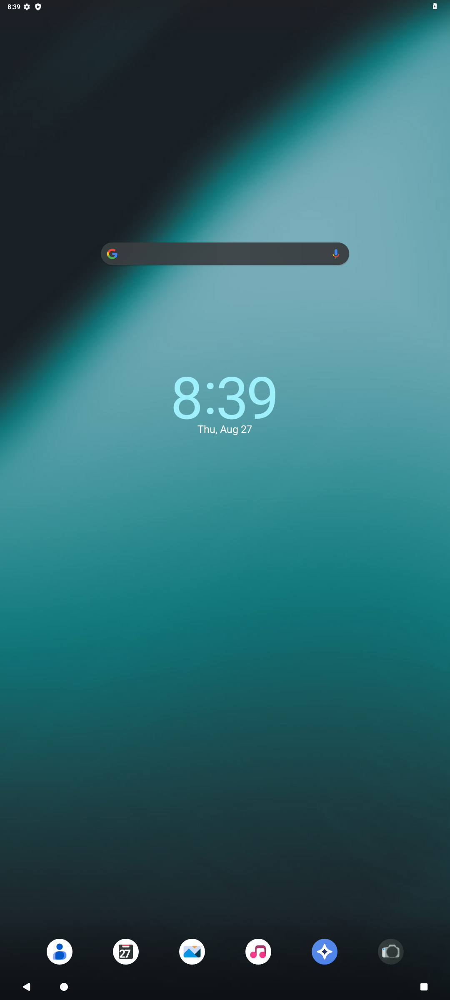

# nx-android-streamer


**Your PC is the phone. Your phone is the glass.**

nx-android-streamer runs a full Android system ([Waydroid](https://waydro.id/)) on your
desktop and streams it to your real phone with the goal that it **feels native** —
same resolution, same refresh rate, real touch, gesture navigation, boot-to-stream.
The phone becomes a thin client for a phone with 16 cores, 24 GB of VRAM and a
wall socket.

<p align="center">
  
  <br>
  <em>A full LineageOS + GAPPS, rendered headless on the PC at exact phone
  geometry — this is what your phone receives.</em>
</p>

Part of the NX suite, but built to be anyone's: geometry, framerate, bitrate and
port are all parameters, so any Linux box with a binder-enabled kernel can be
the phone and anything with Chrome can be the glass. See
[Use it on your phone](#use-it-on-your-phone).

## Why not Sunshine + Moonlight?

They'd work (and stay supported as a reference rig for latency baselines — see
`./start.sh ref`). But they're built for streaming desktop games to a TV, not for
making a remote Android feel like *this* device. Owning the stack lets us do the
native-feel work: portrait-first, launcher-grade client, notification bridging,
clipboard sync, adaptive bitrate tuned for mobile networks.

We don't reinvent the hard parts, though — see [BORROWED.md](BORROWED.md).
This project quotes generously and credits loudly.

## Architecture

```
 PC (server)                                        Pixel 7 (client)
┌─────────────────────────────────────────┐        ┌──────────────────────┐
│  Waydroid (LXC Android, 1080×2400@90)   │        │  nx client           │
│      │ wayland surface                  │        │  (v0.1: PWA,         │
│  headless compositor                    │        │   v0.2+: Kotlin)     │
│   v0.1: sway + xdg-desktop-portal-wlr   │        │                      │
│   v1.0: nx-compositor (wlroots, direct  │  video │  MediaCodec AV1/HEVC │
│         dmabuf → encoder, seat-level    │ ─────► │  low-latency decode  │
│         touch injection)                │ WebRTC │  90 Hz frame pacing  │
│      │ dmabuf / pipewire                │ ◄───── │                      │
│  nx-streamerd                           │  touch │  immersive fullscreen│
│   GStreamer: VAAPI HEVC/AV1 encode      │  audio │  gesture passthrough │
│   webrtcbin + signaling + auth          │        │                      │
│   input inject (v0.1: uinput)           │        │                      │
└─────────────────────────────────────────┘        └──────────────────────┘
              └── transport: Tailscale / WireGuard; WebRTC handles
                  congestion control, FEC, encryption, NAT
```

Details, latency budget, and the native-feel checklist live in
[ARCHITECTURE.md](ARCHITECTURE.md).

## Roadmap

- **v0.1 — it streams.** Headless sway session, portal/PipeWire capture,
  GStreamer VAAPI encode, WebRTC out, browser client on the phone, touch back
  over the datachannel into uinput.
- **v0.2 — it feels native.** Kotlin client: MediaCodec low-latency decode,
  sticky-immersive fullscreen, 90 Hz pacing, audio, hardware keys, reconnect
  that survives the phone sleeping.
- **v0.3 — it *is* the phone.** Optional launcher mode (unlock → stream),
  notification bridge (Waydroid notifications surface as real phone
  notifications), clipboard sync, WiVRn-style adaptive bitrate.
- **v1.0 — the deep cut.** `nx-compositor`: purpose-built wlroots compositor,
  Waydroid as its only client, dmabuf straight into the encoder, touch injected
  at the compositor seat. If WebRTC's latency floor annoys us: raw UDP transport
  à la WiVRn.

## Quick start (server)

Waydroid is installed normally from your distro — this repo does not vendor or
fork it.

```
./start.sh setup    # checks binder, installs waydroid+sway, init GAPPS, sets 1080×2400
./start.sh arm      # ARM translation (libndk) + Widevine via casualsnek/waydroid_script
./start.sh up       # boots the headless Android session
./start.sh stream   # captures it and serves the WebRTC stream (foreground)
./start.sh status   # what's running
./start.sh ref      # optional: Sunshine on the session, as a latency baseline
./start.sh down     # stop everything
```

With `stream` running, open `http://<pc-address>:8765` on the phone (over
Tailscale/WireGuard — the signaling server never listens on the open internet)
and add it to the home screen. One client at a time; the newest wins.

Geometry is overridable: `NXAS_WIDTH/NXAS_HEIGHT/NXAS_HZ` (defaults 1080/2400/90,
i.e. a Pixel 7). The streamer also takes `NXAS_FPS` (60), `NXAS_BITRATE` (12000
kbps) and `NXAS_PORT` (8765).

Note: this is an uncertified Android container. Play Store works after device
registration, but Play-Integrity-gated apps (banking, Wallet) won't, and DRM is
Widevine L3.

## Use it on your phone

Nothing here is Pixel-specific. To match *your* phone:

1. Find its resolution and refresh rate (`adb shell wm size` on the phone, or
   just its spec sheet).
2. Export the geometry before `setup`/`up`:
   `NXAS_WIDTH=1440 NXAS_HEIGHT=3120 NXAS_HZ=120 ./start.sh setup`
3. Put the PC and phone on the same private network — Tailscale is the
   zero-config option, plain WireGuard works the same. Do **not** port-forward
   the streamer to the open internet; it is designed to live inside a VPN.
4. Open `http://<pc-address>:8765` in Chrome on the phone, tap once for
   fullscreen, and add it to the home screen.

### Requirements

| Piece | Needs |
|---|---|
| Kernel | binder support (`CONFIG_ANDROID_BINDER_IPC`) — stock on CachyOS/zen; `binder_linux-dkms` elsewhere |
| GPU | any VAAPI H.264 encoder (AMD/Intel; tested on RDNA3). No VAAPI → automatic `x264` software fallback |
| Host | Waydroid, sway, wf-recorder, GStreamer (good/bad/va plugins), aiohttp — `./start.sh setup` installs all of it on Arch-likes |
| Phone | any browser with WebRTC + H.264 (i.e. all of them). Hardware decode recommended, not required |

Non-Arch distros: `setup` currently speaks pacman. The package list it would
install is printed before it dies — install the equivalents with your package
manager and re-run; every other subcommand is distro-agnostic. Patches making
`setup` speak apt/dnf are very welcome.

## Contributing

See [CONTRIBUTING.md](CONTRIBUTING.md). The one house rule that isn't standard:
code adapted from another project must carry an attribution header and a row in
[BORROWED.md](BORROWED.md) — this repo quotes generously and credits loudly.

## License

GPL-3.0 — chosen deliberately so we can borrow from Sunshine, Moonlight, and
WiVRn (all GPLv3). See [LICENSE](LICENSE) and [BORROWED.md](BORROWED.md).
